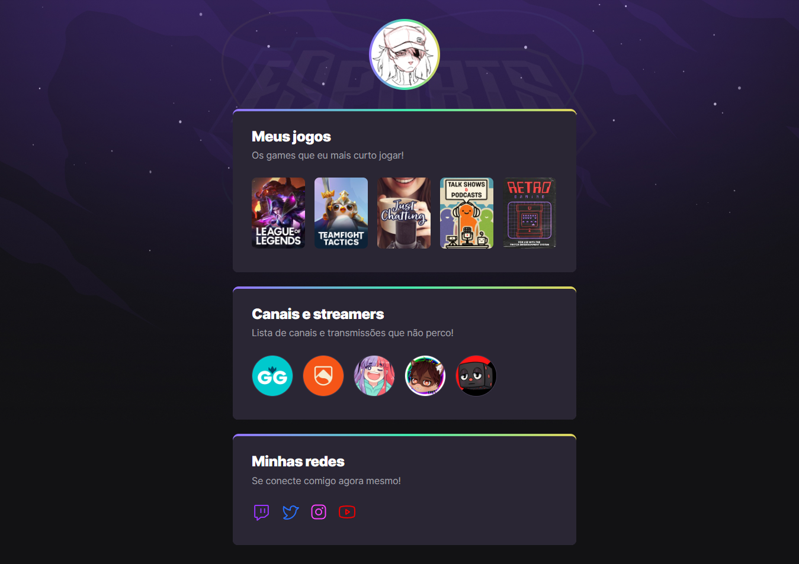

# NLW eSports

> Trilha Explorer

Projeto Construído no evento Next Level Week da Rocketseat.

[🔗 Clique aqui para acessar](https://nathyhotz.github.io/nlw-esports-explorer)

## ⚙️Tecnologias 

- HTML 
- CSS
- Git e Github

## 📚 Aprendizado

- Como construir e desenvolver uma aplicação do zero usando fundamentos basicos para iniciantes em programação

## 📧 Contato

nathzhotz@gmail.com